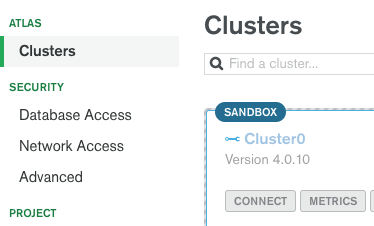
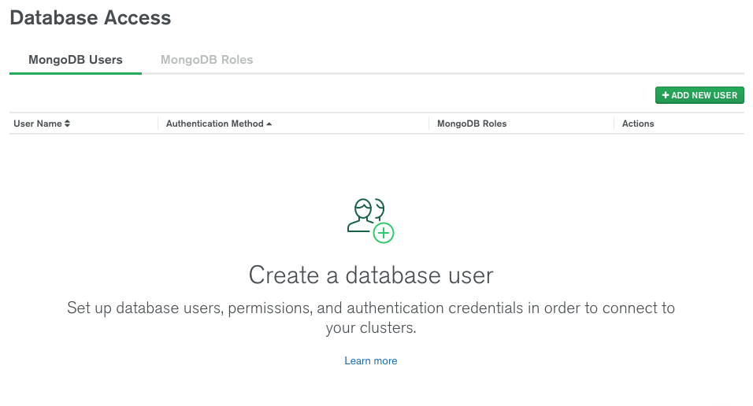
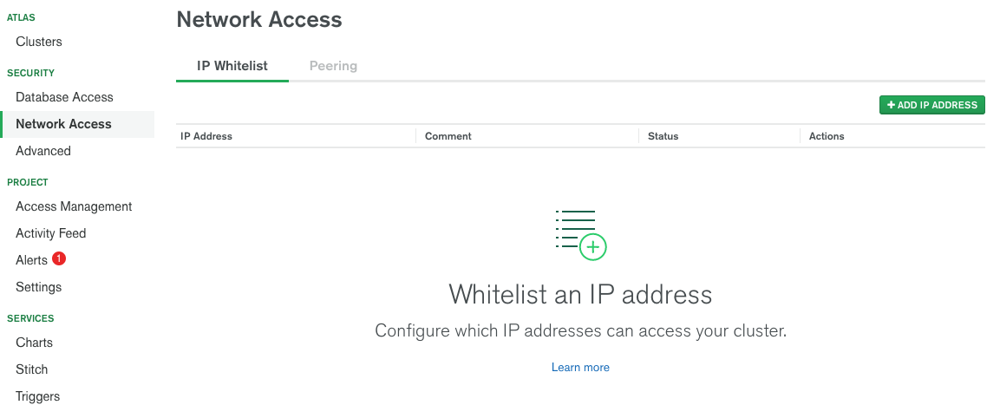

# MongoDB Setup

* Create a free account on MongoDB Atlas at [cloud.mongodb.com](https://cloud.mongodb.com) Click on “Try Free” at the top right if you do not have an account or “Sign In” if you already have a login. 

* Once on the MongoDB Atlas Homepage, select “Build a Cluster”

* Create a New Cluster by selecting Google Cloud Platform as a “Cloud Provider” and select an M0 (free) instance. Optionally provide a name for your cluster but leave all other settings as-is. Click "Create Cluster" on the bottom right to deploy your M0 cluster.

* While this spins up, lets click on the “Database Access” submenu, under “Security” on the left menu. 

* Click the “Add New User” button on top right

* Enter a user name. For our demo, let’s enter `mdbadmin` and enter a secure password.  Record your user name and password in a safe location for reference later. Under “User Privileges”, select “Atlas admin” and click on the “Add User button to complete this section.

* Lets click on the “Network Access” submenu, under “Security” on the left menu. Click on “Add IP Address”.

* Select “Allow Access from Anywhere” for the purpose of this demo and click on “Confirm”.  

*Note*:  When running a cluster in production, you will want to narrow the scope of where your database can be accessed and specify a specific IP address/CIDR block and/or using VPC peered connection.

* Go to “Clusters” submenu, under “Atlas” on the left menu. 

* Click on the "Collections" button and create a database called `gcpdemo` with a collection called `democol` 

* Go to “Clusters” submenu, under “Atlas” on the left menu. 

* Click on “Connect” button. A window will open. Select “Connect Your Application.” Choose Python and copy the connection string they give you. We will need this later.