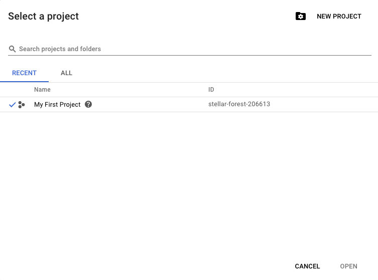
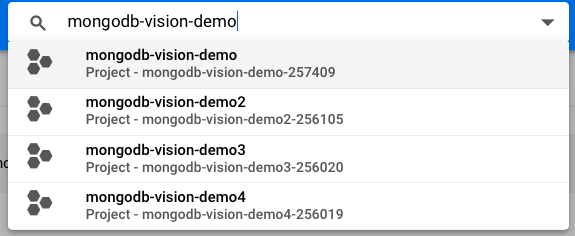
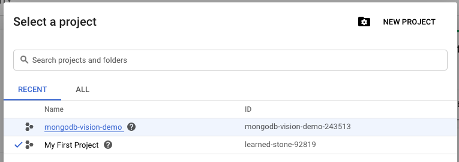
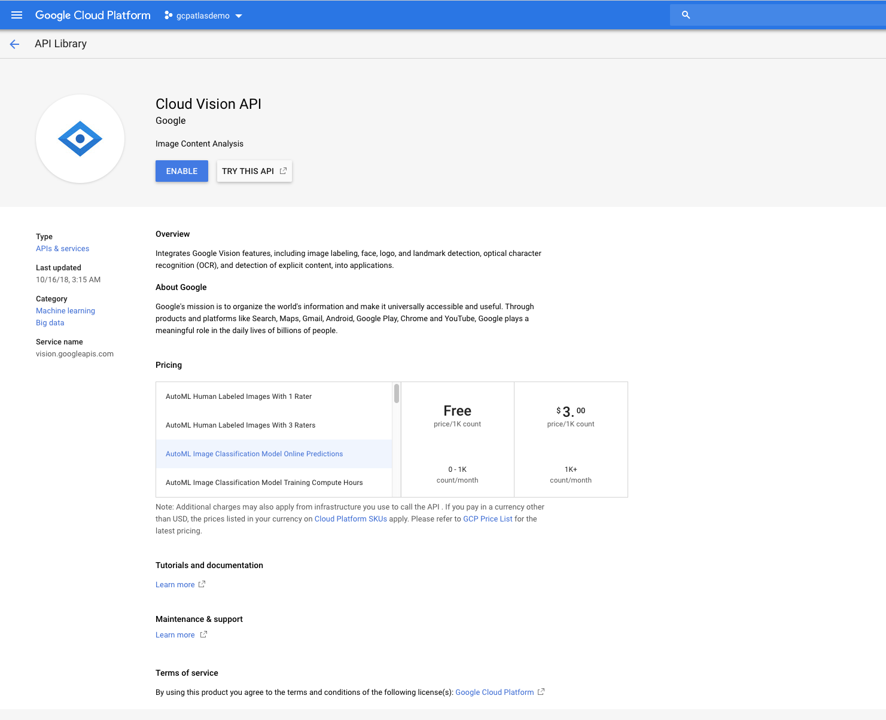
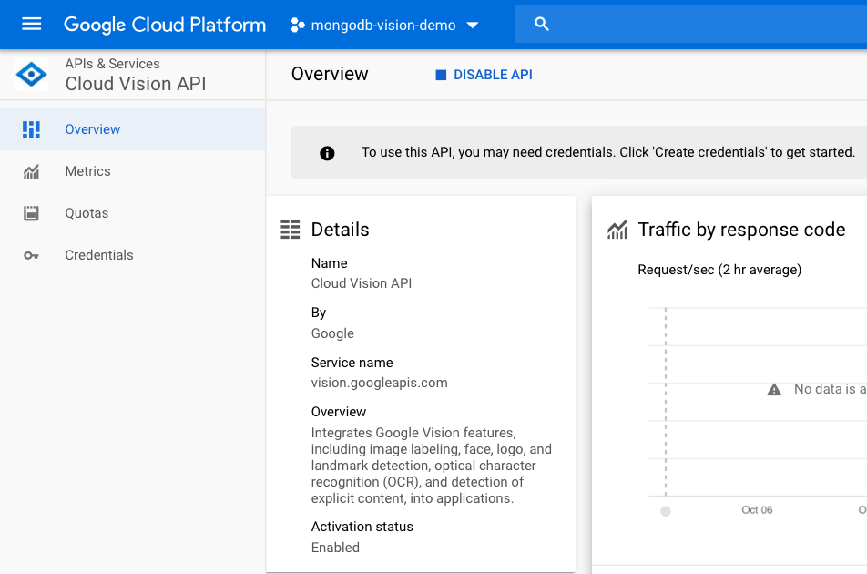

# GCP project and configuring GCP Vision API setup

* Go to cloud.google.com and login with your Google account. If you don't have a Google account, please create a free trial account by following instructions at this [link](https://console.cloud.google.com/freetrial).

* If not already there, go to https://console.cloud.google.com/

* Create a new project, by selecting the following dropdown in the top left:

* A new window will pop up.  In it, select "New Project" in the top right:

* Give your Vision API demo a new project name.  Let's go with “mongodb-vision-demo” and click the “Create” button:

* After your new project is done being created, make the project your current project. Either type the name in the main search bar

Or go back to the dropdown from before and select your new project name:

* When the right project is selected, your screen should look like this

* Also the name will change to reflect this in the dropdown in the top left of your console:

* In the search box, search for "Cloud Vision API" and choose that option in the drop down

* Enable the API

* Your screen should now look like below

* Create a credential of type "Service Account Key" with a name of your choosing, Key Type is JSON, and Role of `Owner` as follows.  Select from the top left hamburger menu the "APIs & Services" entry. From the submenu select "Credentials", like below:

* In the center of the screen a select of different credentials is offered. Select here "Service account key", as below:

* From the service account drop down, select "New Service account", and provide any name. From the Select a role dropdown, select "Project" and then "Owner".  

* If all looks like below, press "Create"

* When saving, it will download the JSON file. Read its contents put it in `gcpcreds.json`

